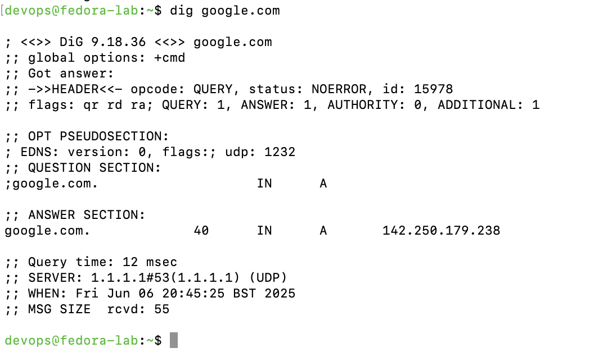

## ⚙️ Phase 3: Linux Networking Lab

This phase focuses on essential networking concepts and commands used to inspect and troubleshoot network configurations on a Linux system. The commands were executed on a remote Fedora host accessed via hardened SSH from a MacBook terminal.


## 📄 Download Full Lab Report (PDF)

👉 [Click here to download the complete Linux Networking Lab PDF](https://github.com/carlos-tech-ops/linux-networking-lab/raw/main/docs/linux-networking-lab.pdf)


### ✅ Objectives

- Display and interpret IP address configuration
- Inspect routing table entries
- Check device status with `nmcli`
- Explore network interfaces using `ip link`

### 🛠️ Tools Used

- `ip a` – shows IP address assignment
- `ip route` – displays routing table
- `nmcli device status` – checks network manager status
- `ip link show` – inspects interface state and stats
- Fedora Linux (target node)
- macOS Terminal (control node)

### 📸 Screenshots

**1. IP Address Output**
  


**2. Routing Table**


**3. NMCLI Device Status**


**4. IP Link Summary**


---

> All outputs were captured during real command-line sessions as part of the `linux-networking-lab`. This project is part of a Linux+ certification training path and documents validated system behavior on a Fedora server.

---

## 🌐 Phase 3A – Interfaces & Static IP Setup

Manually assign a static IP to the Fedora laptop and map it to a custom hostname using `/etc/hosts`. This setup improves SSH stability, scripting, and internal network recognition — all critical for sysadmin and DevOps tasks.

---

### 🔧 Steps Performed

```bash
# 1. Set static IP, gateway, and DNS via nmcli
sudo nmcli con mod SHELL_5C4F_5G ipv4.addresses 192.168.1.50/24
sudo nmcli con mod SHELL_5C4F_5G ipv4.gateway 192.168.1.1
sudo nmcli con mod SHELL_5C4F_5G ipv4.dns "1.1.1.1 8.8.8.8"
sudo nmcli con mod SHELL_5C4F_5G ipv4.method manual
sudo nmcli con down SHELL_5C4F_5G && sudo nmcli con up SHELL_5C4F_5G

# 2. Confirm IP works with ping
ping -c 3 8.8.8.8

# 3. Set custom hostname
sudo hostname fedora-lab
# (hostnamectl set-hostname failed due to PolicyKit auth timeout)

# 4. Update /etc/hosts
sudo nano /etc/hosts
# → Add line: 192.168.1.50    fedora-lab

# 5. Validate hostname resolution
ping -c 3 fedora-lab
```

---

### 🧪 Output Validation

| ✅ Checkpoint                         | Result                                   |
|--------------------------------------|------------------------------------------|
| Static IP applied via `nmcli`        | `192.168.1.50/24` assigned to Wi-Fi      |
| Internet test with ping              | Successful: packets returned from 8.8.8.8 |
| `hostname` command output            | Transient hostname set to `fedora-lab`   |
| `/etc/hosts` manually updated        | Maps `192.168.1.50` to `fedora-lab`      |
| `ping fedora-lab`                    | <1 ms latency — local resolution working |

---

### 📸 Screenshots

| Step | Description                             | Screenshot                              |
|------|-----------------------------------------|------------------------------------------|
| 1️⃣  | `nmcli` static IP config + ping test     |  |
| 2️⃣  | Hostname set via `hostnamectl` attempt   |  |
| 3️⃣  | `ping fedora-lab` successful             |  |

---

## 📡 Phase 3B – DNS Configuration & Testing

In this section, we configure DNS resolvers manually and validate DNS resolution using diagnostic tools.

---

### 🛠️ DNS Configuration

| Step | Command | Purpose |
|------|---------|---------|
| 1️⃣  | `sudo nano /etc/resolv.conf` | Edit DNS configuration file manually |
| 2️⃣  | Add the following lines: <br> `nameserver 1.1.1.1` <br> `nameserver 8.8.8.8` | Set Cloudflare and Google as DNS resolvers |
| 3️⃣  | Save and exit (`CTRL + O`, `Enter`, `CTRL + X`) | Apply the DNS changes |
| 4️⃣  | `cat /etc/resolv.conf` | Confirm resolvers are correctly set |

## 📸 Screenshot:  
_

---

### 🧪 DNS Lookup Test (dig)

| Step | Command | Description |
|------|---------|-------------|
| ✅   | `dig github.com` | Query DNS to resolve GitHub’s IP address |

Expected Output:
- You should see an **ANSWER SECTION** with GitHub's IP addresses.
- `Query time`, `SERVER`, and `WHEN` values validate DNS resolution is working.

## 📸 Screenshot:  
_

---

### 🧪 DNS Test (ping)

| Step | Command | Description |
|------|---------|-------------|
| ✅   | `ping -c 3 github.com` | Validate name resolution + connectivity |

Expected Output:
- 3 replies from GitHub’s IP (usually a `20.x.x.x` address).
- **0% packet loss**, and time in milliseconds.

## 📸 Screenshot:  
_

---

---

## 🧪 Phase 3C – Network Diagnostics Tools

In this phase, we tested and validated network configurations, DNS functionality, service routes, and port availability using key diagnostic tools.

---

### 🛠️ Tools Used

| Command                | Purpose                                      |
|------------------------|----------------------------------------------|
| `ping`                 | Test basic IP connectivity                   |
| `dig`                  | Perform DNS lookup                           |
| `ss -tuln`             | Show listening ports (TCP/UDP)               |
| `netstat -tuln`        | Legacy alternative to `ss`                   |
| `nmcli dev show`       | Display detailed device connection info      |
| `journalctl -u NetworkManager` | View network-related logs          |
| `ip route`             | View current routing table                   |
| `traceroute`           | Show packet path to destination              |

---

### 📸 Screenshots

| Step | Description                             | Screenshot |
|------|-----------------------------------------|------------|
| 1️⃣  | `ping google.com` successful            |  |
| 2️⃣  | `dig google.com` DNS resolution         |  |
| 3️⃣  | `ss -tuln` showing listening ports       |  |
| 4️⃣  | `netstat -tuln` legacy output            |  |
| 5️⃣  | `nmcli dev show` detailed info           |  |
| 6️⃣  | `journalctl -u NetworkManager` log check |  |
| 7️⃣  | `ip route` routing summary               |  |
| 8️⃣  | `traceroute google.com` multi-hop test   |  |

---

## 🔐 Phase 3D – SSH & Remote Connectivity

This section validates that SSH is securely configured and running on the Fedora lab machine, using diagnostics and a successful remote login from the MacBook.

---

#### 🛡️ SSH Port Listening

Checked whether the SSH daemon is listening on the correct custom port (`2222`):

```bash
sudo ss -tuln | grep 2222
```

✅ Validation: Port `2222` is actively listening for incoming SSH connections.

📸 Screenshot:


---

#### 🧠 SSH Daemon Configuration

Inspected `/etc/ssh/sshd_config` to confirm secure options:

- `Port 2222`
- `PasswordAuthentication no`
- `PermitRootLogin no`
- `AllowUsers sysops`
- `Protocol 2`

```bash
sudo nano /etc/ssh/sshd_config
```

📸 Screenshots:
- 
- 

---

#### 📜 SSH Service Logs (journalctl)

Used `journalctl` to view logs for `sshd` and confirm service restart and activity:

```bash
sudo journalctl -u sshd --since "15 minutes ago"
```

✅ Validation: SSH service restarted and bound to the correct port.

📸 Screenshot:


---

#### 💻 Remote Login Test from MacBook

Used the MacBook Terminal to connect to the Fedora machine via:

```bash
ssh sysops@192.168.1.50 -p 2222
```

✅ Login successful using SSH key-based authentication.

📸 Screenshot:


---

✅ **Result**: SSH is securely configured, actively running on port 2222, and accessible only via key-based login from trusted devices.

---

## 🔥 Phase 3E – Firewall & Port Control

This phase focused on inspecting and modifying the Fedora firewall using `firewalld` to allow secure access on the custom SSH port (`2222`). We validated port accessibility with system commands and remote scanning tools.

---

### 🎯 Objectives

- Confirm firewalld is running and managing zones
- Open TCP port 2222 permanently
- Reload firewall rules
- Validate SSH port status with `ss`, `nmap`, and a live SSH login

---

### 🛠️ Tools Used

| Command                      | Purpose                                |
|------------------------------|----------------------------------------|
| `firewall-cmd`               | Manage firewalld rules and zones       |
| `ss -tuln`                   | Show listening TCP/UDP ports           |
| `nmap`                       | Scan open ports from another machine   |
| `ssh`                        | Test connectivity to the SSH service   |

---

### 🔍 Firewall State & Zones

| ✅ Checkpoint                           | Output                                |
|----------------------------------------|----------------------------------------|
| `sudo firewall-cmd --state`            | `running` – confirms firewalld is active |
| `sudo firewall-cmd --get-active-zones`| Displays zones: `FedoraWorkstation`, `trusted`, `drop` |
| `sudo firewall-cmd --list-all`        | Shows `drop` as default with custom rules |

📸 Screenshots:

- 
- 
- 

---

### 🔐 Port 2222 Configuration

| Action                        | Command(s) Executed                                   |
|------------------------------|--------------------------------------------------------|
| Open port temporarily        | `sudo firewall-cmd --add-port=2222/tcp`               |
| Open port permanently        | `sudo firewall-cmd --permanent --add-port=2222/tcp`   |
| Reload firewall              | `sudo firewall-cmd --reload`                          |
| Confirm rule took effect     | `sudo ss -tuln \| grep 2222`                          |

📸 Screenshots:

- 
- 
- 

---

### 🌐 External Port Verification (nmap)

From the Fedora machine, we scanned its own IP to ensure port 2222 is open:

```bash
sudo nmap -p 2222 192.168.1.50
```

✅ Output: Port 2222 was reported as `open`.

📸 Screenshot:

- 

---

### ✅ SSH Remote Login via Port 2222

Final test from MacBook to Fedora:

```bash
ssh sysops@192.168.1.50 -p 2222
```

✅ Result: Login successful with public key authentication.

📸 Screenshot:

- 

---

### 🧠 Summary

| ✅ Task                                  | Status     |
|------------------------------------------|------------|
| firewalld confirmed active               | ✅          |
| port 2222 opened temporarily + permanently | ✅        |
| firewall rules reloaded successfully     | ✅          |
| `ss` confirmed SSH daemon listening      | ✅          |
| `nmap` confirmed remote visibility       | ✅          |
| SSH login using port 2222 validated      | ✅          |

> 🔐 **Why this matters:** Real-world servers are often protected by firewalls with limited open ports. Knowing how to inspect, configure, and validate firewall access is essential for sysadmins, DevOps, and security professionals.

---

## ✅ Phase 3F – Final Recap & Validation Checklist

This final phase summarizes the outcomes of our Linux Networking Lab across Phases 3A–3E, validating that each core concept was understood, tested, and documented.

---

### 📊 Objectives Recap Table

| Phase | Topic                             | Objective                                                                  | Status     | Evidence                         |
|-------|-----------------------------------|----------------------------------------------------------------------------|------------|----------------------------------|
| 3A    | Interfaces & Static IP Setup      | Display IP, set static IP, inspect routes                                  | ✅ Done     | Screenshots 01–04, 05            |
| 3B    | Hostname & DNS Configuration      | Set hostname, edit /etc/hosts, configure DNS, test resolution              | ✅ Done     | Screenshots 06–07, 08–10         |
| 3C    | Network Diagnostics Tools         | Use `ping`, `dig`, `ss`, `netstat`, `nmcli`, `journalctl`, `traceroute`   | ✅ Done     | Screenshots 11–18                |
| 3D    | SSH & Remote Connectivity         | Harden SSH config, verify logs, test login via port 2222                   | ✅ Done     | Screenshots 19–21                |
| 3E    | Firewall & Port Control           | Validate `firewalld`, open SSH port, reload, test via Nmap and SSH         | ✅ Done     | Screenshots 22–29                |

---

### 🏁 Final Remarks

All key networking and security topics were executed live in a Fedora Linux environment and remotely validated from a MacBook control node. This lab proves hands-on mastery over:

- IP and DNS configuration
- SSH hardening and access control
- Firewall zone and port management
- Service diagnostics using real-world CLI tools

---
